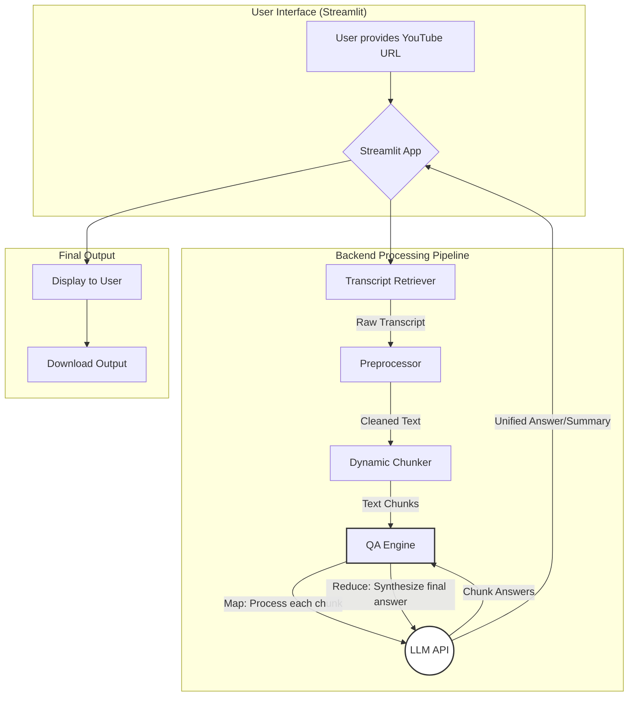

# 🎬 YouTube Transcript Q&A & Summarizer

**An AI-powered application that transforms YouTube videos into searchable, interactive knowledge sources through advanced Large Language Models (LLMs).**

[](https://www.python.org/)
[](https://streamlit.io/)
[](LICENSE)
[](tests/)


## 🚀 Overview 

YouTube Transcript Q&A & Summarizer is a modular, end-to-end pipeline that:

- **Retrieves transcripts** from YouTube videos automatically
- **Dynamically chunks** long content for optimal LLM processing
- **Offers a Streamlit web interface** for seamless user experience
- **Transforms videos** into searchable, interactive knowledge sources

## Project Architecture

Here is a visual overview of the application's pipeline, from user input to final output.




## ✨ Features

### 🎯 **Instant Transcript Retrieval**
Extracts subtitles automatically from YouTube videos with available captions.

### 🤖 **LLM-Powered Summarization**
Converts long video transcripts into concise, informative summaries using Google Gemini API.

### ❓ **Ask Any Question**
Enter natural language queries and get accurate answers based on video content.

### 🔄 **Map-Reduce Aggregation**
Efficiently processes long videos by chunking content and combining answers or summaries.

### 🌐 **Streamlit Web App**
Simple, interactive user interface to upload links, ask questions, and view results.

### 💾 **Downloadable Results**
Export generated summaries or answers as `.txt` files for offline use.

### 🧪 **Robust Testing**
Unit-tested modular pipeline using pytest with comprehensive coverage.

### 📊 **Logging & Error Handling**
Centralized logging system with graceful failure mechanisms and detailed error tracking.

## 📁 Project Structure

```bash
project-root/
├── app.py # Streamlit frontend
├── yt_logo.png # Logo for branding
├── requirements.txt # Dependencies
├── requirements-dev.txt # Dev dependencies (pytest, etc.)
├── pytest.ini # Pytest configuration
├── .env # API keys and configs (not committed)
├── .gitignore # Git ignore rules
├── README.md # Project documentation
├── setup.py # For packaging , still to launch but made it
├── logs/ # Runtime logs
├── src/
│ ├── init.py
│ ├── components/
│ │ ├── init.py
│ │ ├── main.py # Main orchestrator
│ │ ├── preprocessor.py # Text cleaning & chunking
│ │ ├── qa_engine.py # LLM interface
│ │ ├── transcript_retriever.py # YouTube transcript fetching
│ │ └── internalTesting/ # Optional submodules
│ ├── logger.py # Centralized logging
│ ├── exception.py # Custom error handling
│ └── utils.py # Helper utilities
└── tests/
├── test_preprocessor.py
├── test_qa_engine.py
└── test_transcript_retriever.py
```


## 🛠️ Prerequisites

- **Python 3.8+**
- **YouTube video with captions**
- **Google Gemini API key** (or any supported LLM)
- **Internet connection** for API calls

## 📥 Installation

### 1. Clone the Repository
```bash
git clone https://github.com/siddhamapple/YoutubeSummarizer
cd YoutubeSummarizer
```


### 2. Create Virtual Environment

```bash
python -m venv venv
```
Activate (Linux/Mac)
```bash
source venv/bin/activate 
```
Activate WIndows
```bash
venv\Scripts\activate 
```


### 3. Install Dependencies

For regular usage-
```bash
pip install -r requirements.txt
```

For development (includes testing tools)-
```bash
pip install -r requirements-dev.txt
```


### 4. Environment Configuration
Create a `.env` file in the project root:

```bash
GEMINI_API_KEY=your_gemini_api_key_here
```


##  Usage

### Quick Start

```bash
streamlit run app.py
```


Visit: `http://localhost:8501`

### App Workflow
1. **Paste YouTube Link** → Enter any YouTube video URL
2. **Choose Mode** → Select "Summarize" or "Ask a Question"
3. **Process Transcript** → App fetches and processes video transcript
4. **LLM Processing** → AI runs on each chunk (Map-Reduce approach)
5. **View Results** → Final answer/summary displayed
6. **Download** → Optional: Save output as `.txt` file

## 🧪 Running Tests

Execute the complete test suite:
```bash
pytest
```


### Test Coverage
The testing suite covers:

- ✅ **TranscriptRetriever**: Verifies transcript fetch accuracy from YouTube
- ✅ **Preprocessor**: Validates chunking, cleaning, and formatting logic
- ✅ **QnAEngine**: Checks consistency and quality of LLM-generated answers/summaries


```bash
tests/
├── test_preprocessor.py
├── test_qa_engine.py
└── test_transcript_retriever.py
```


## 🔧 Core Technologies

| Tool/Library | Description |
|--------------|-------------|
| **Streamlit** | Frontend UI for interacting with the app |
| **Google Gemini API** | Large Language Model for Q&A and summarization |
| **python-dotenv** | Manages .env configurations securely |
| **Pytest** | Testing framework for backend logic verification |
| **Custom Modules** | Modular Python architecture under `src/components/` |

### Modular Design Components

- **`transcript_retriever.py`**: Fetches captions from YouTube videos
- **`preprocessor.py`**: Cleans and chunks transcript content
- **`qa_engine.py`**: Interfaces with LLM for Q&A/summaries
- **`main.py`**: Orchestrates the entire pipeline

## 🗺️ Roadmap

### 🔮 Upcoming Features

- **🌍 Multilingual Support**: Auto-detect video language and translate
- **⚡ Asynchronous Processing**: Faster summarization with async LLM calls
- **☁️ Deployment Options**: Push to Streamlit Cloud / Hugging Face Spaces
- **⌨️ CLI Utilities**: Command-line support for batch summarization
- **🎨 UI Polish**: Improve layout, theme, and mobile responsiveness
- **📈 Analytics**: Usage tracking and performance metrics

## 👨‍💻 Author

**Siddham Jain**  
🎓 B.Tech in Electrical and Computer Engineering | Shiv Nadar IOE  
📧 siddhamjainn@gmail.com  
📱 +919625208689

## 🤝 Contributing

We welcome contributions! Follow these steps:

1. **Fork** this repository
2. **Create** a new feature branch (`git checkout -b feature-name`)
3. **Commit** your changes (`git commit -am 'Add feature'`)
4. **Push** to the branch (`git push origin feature-name`)
5. **Open** a pull request 🚀

### Development Guidelines

- Follow PEP 8 style guidelines
- Write comprehensive tests for new features
- Update documentation for any API changes
- Use only meaningful commit messages 

---

**⭐ If you find this project helpful, please give it a star!**

For questions, issues, or feature requests, please open an issue on GitHub.


